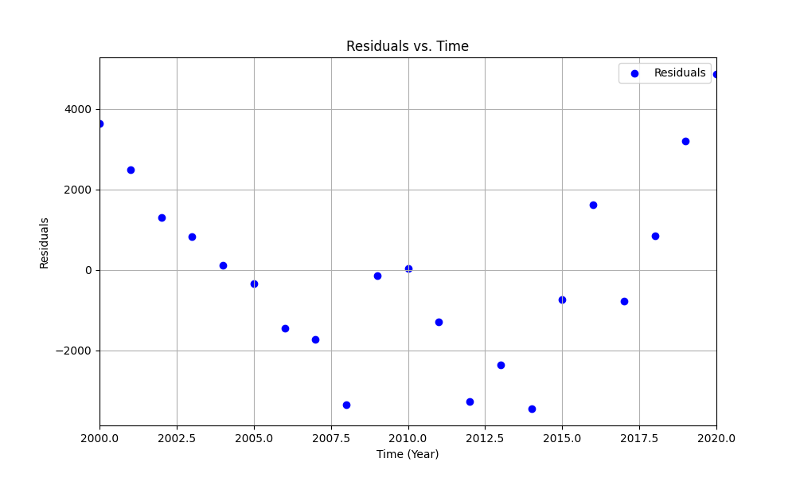

---
# You can also start simply with 'default'
theme: seriph
# random image from a curated Unsplash collection by Anthony
# like them? see https://unsplash.com/collections/94734566/slidev
background: https://cover.sli.dev
# some information about your slides (markdown enabled)
title: Welcome to Slidev
info: |
  ## Slidev Starter Template
  Presentation slides for developers.

  Learn more at [Sli.dev](https://sli.dev)
# apply unocss classes to the current slide
class: text-center
# https://sli.dev/features/drawing
drawings:
  persist: false
# slide transition: https://sli.dev/guide/animations.html#slide-transitions
transition: slide-left
# enable MDC Syntax: https://sli.dev/features/mdc
mdc: true
# take snapshot for each slide in the overview
overviewSnapshots: true
---

# Course 01: 一元线性回归

Simple Linear Regression

$\hat{y} = \theta_0 + \theta_1 x$

$$
\begin{cases}
\theta_1 = \frac{\displaystyle\sum_{i=1}^{n} (x_i - \bar{x})(y_i - \bar{y})}{\displaystyle\sum_{i=1}^{n} (x_i - \bar{x})^2} \\
\theta_0 = \bar{y} - \theta_1 \bar{x}
\end{cases}
$$

---
layout: section
---

# Section 1: 引入

---
layout: two-cols
---

# 上海市房价整体走势


<v-clicks>

> 数据经过正则化，`.5` 代表当年 1 月，`.75` 代表当年 7 月．

</v-clicks>

::right::

<v-clicks>

观察整体数据，有没有整体的趋势？

1. 房价整体上升
2. 上升趋势可视为线性
3. 有小部分波动

是否可以以此来预测未来房价（不考虑 COVID-19 和经济下滑问题）？

<span class="text-xl color-red">用一条最能描述数据的直线来预测未来房价！</span>

</v-clicks>

---
layout: two-cols
---

# 一元线性回归

> 在统计学中，线性回归（英语：`linear regression`）是利用称为线性回归方程的最小二乘函数对一个或多个**自变量**和**因变量**之间**关系**进行建模的一种回归分析．这种函数是一个或多个称为回归系数的模型参数的线性组合．只有一个自变量的情况称为一元线性回归（简单回归），大于一个自变量情况的叫做多元回归．
> 
> ——[维基百科](https://zh.wikipedia.org/wiki/%E7%B7%9A%E6%80%A7%E8%BF%B4%E6%AD%B8)

::right::


---
layout: section
---

# Section 2: 回归函数与参数

---

# 回归函数

<v-clicks>

一元线性回归的回归函数为：

$${\color{red}\hat{y}} = \theta_0 + \theta_1 x$$

- $\hat{y}$：预测值，其中的 `^` 表示预测值，以区别于真实值 $y$．
- $\theta_0$：截距，表示当 $x=0$ 时的 $y$ 值．
- $\theta_1$：斜率，表示 $x$ 增加一个单位时 $y$ 的变化量．

可以看出，回归函数是一个关于 $x$ 的线性函数．

</v-clicks>

---
layout: section
---

# 如何知道拟合的好坏？

---

# 残差与损失函数

<v-clicks>

- 残差：$e_i = y_i - \hat{y}_i$，表示**单个**样本的预测值与真实值的差距．

</v-clicks>

<div class="grid grid-cols-2 gap-4">
  <div>
    
  </div>
  <div v-click class="pt-4">
    残差的绝对值越小，表示在该样本上的预测越准确．一般而言，残差应当在以 0 为中心的上下均匀分布．可以看出，该拟合的残差分布整体较为均匀，拟合效果还行，但应该有更好的方法．
  </div>
</div>

---

# 残差与损失函数

<p class="text-[1.5rem]" v-click>如果把所有样本的残差加起来呢？</p>

<div v-click v-click.hide>

$$J(\theta_0, \theta_1) = \sum_{i=1}^{n} e_i = \sum_{i=1}^{n} (y_i - \hat{y}_i) = \sum_{i=1}^{n} (y_i - \theta_0 - \theta_1 x_i)$$

</div>

<v-clicks>

湿拜．

</v-clicks>

<div v-click v-click.hide>

$$J(\theta_0, \theta_1) = \sum_{i=1}^{n} \lvert e_i \rvert = \sum_{i=1}^{n} \lvert y_i - \hat{y}_i \rvert = \sum_{i=1}^{n} \lvert y_i - \theta_0 - \theta_1 x_i \rvert?$$

</div>

<v-clicks>

$$J(\theta_0, \theta_1) = \sum_{i=1}^{n} e_i^2 = \sum_{i=1}^{n} (y_i - \hat{y}_i)^2 = \sum_{i=1}^{n} (y_i - \theta_0 - \theta_1 x_i)^2$$

你说得对，但是<span v-mark.circle>乘法</span>和绝对值哪个简单？

~~肯定是绝对值啊！~~

但是平方更加符合正态分布的假设．

</v-clicks>

---

# 最小二乘法

<v-clicks>

1. 展开公式：
   $$
   Q(\theta_0, \theta_1) = \sum_{i=1}^n [(y_i - \theta_1 x_i - \bar{y} + \theta_1 \bar{x}) + (\bar{y} - \theta_1 \bar{x}) - \theta_0]^2
   $$

2. 简化条件：
   $$
   Q(\theta_0, \theta_1) = \sum_{i=1}^n [(y_i - \bar{y}) - \theta_1(x_i - \bar{x}) + (\bar{y} - \theta_1 \bar{x} - \theta_0)]^2
   $$

3. 展开平方式：
   $$
   Q(\theta_0, \theta_1) = \sum_{i=1}^n [(y_i - \bar{y}) - \theta_1(x_i - \bar{x})]^2 + 2 \sum_{i=1}^n [(y_i - \bar{y}) - \theta_1(x_i - \bar{x})] \cdot \\ (\bar{y} - \theta_1 \bar{x} - \theta_0) + n (\bar{y} - \theta_1 \bar{x} - \theta_0)^2
   $$

</v-clicks>

---

4. <span v-mark.circle v-mark.red>注意到</span>中间表达式：
   $$
   \sum_{i=1}^n [(y_i - \bar{y}) - \theta_1(x_i - \bar{x})] (\bar{y} - \theta_1\bar{x} - \theta_0) = (\bar{y} - \theta_1 \bar{x} - \theta_0) \sum_{i=1}^n [(y_i - \bar{y}) - \theta_1(x_i - \bar{x})]
   $$

   > 我可不是<span v-mark.underline>注意力大师</span>

   可以简化为：
   $$
   (\bar{y} - \theta_0 \bar{x} - \theta_1) [n\bar{y} - n\bar{y} - \theta_1(n\bar{x} - n\bar{x})] = 0
   $$

<v-clicks>

5. 因此：
   $$
   Q(a, b) = \sum_{i=1}^n [(y_i - \bar{y}) - \theta_1(x_i - \bar{x})]^2 + n (\bar{y} - \theta_1 \bar{x} - \theta_0)^2
   $$


可根据该公式求解 $\theta_0$ 和 $\theta_1$：$\begin{cases}\theta_1 = \frac{\sum_{i=1}^{n} (x_i - \bar{x})(y_i - \bar{y})}{\sum_{i=1}^{n} (x_i - \bar{x})^2} \\\theta_0 = \bar{y} - \theta_1 \bar{x}\end{cases}$

<span class="color-gray">过程来自《普通高中教科书 数学 选择性必修 第三册》</span>

</v-clicks>

---

# 仁济视角：计算机如何优化

<v-clicks>

<div class="text-[48px] text-center mt-8">梯度下降！</div>

> 相关算法需要<span v-mark.red>偏导数</span>和<span v-mark.red>向量</span>的知识，将在下节课详细讲解．

</v-clicks>

---
layout: section
---

# 如何手搓一个回归模型？

---

# 方法一：`Excel` 即可

<v-clicks>

当然，后面就不行了．

<video controls class="w-[60%]">
<source src="./images/excel-regression.mov" type="video/mp4">
</video>

</v-clicks>

---

# 方法二：使用 `scikit-learn`

<v-clicks>

除了一元线性回归，`scikit-learn` 还支持多元线性回归、逻辑回归等．

```python {6-7}{lines:true}
from sklearn.linear_model import LinearRegression
import pandas as pd

data = pd.read_csv('data.csv')

model = LinearRegression()
model.fit(data[['x']], data['y'])

print(model.coef_, model.intercept_)
```

环境搭建：

```bash
pip install scikit-learn pandas numpy
```

</v-clicks>

---
layout: section
---

# Do It Yourself

---
layout: end
---

# Thank you!
