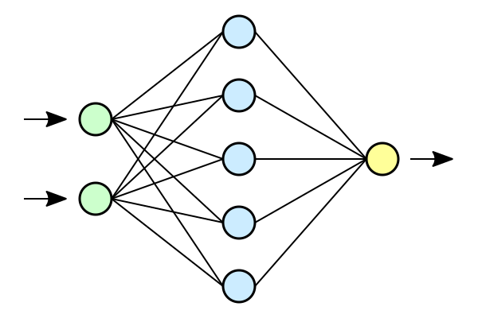
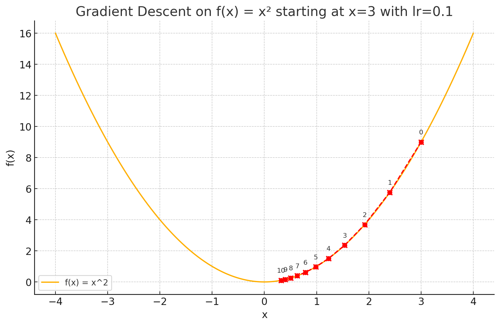
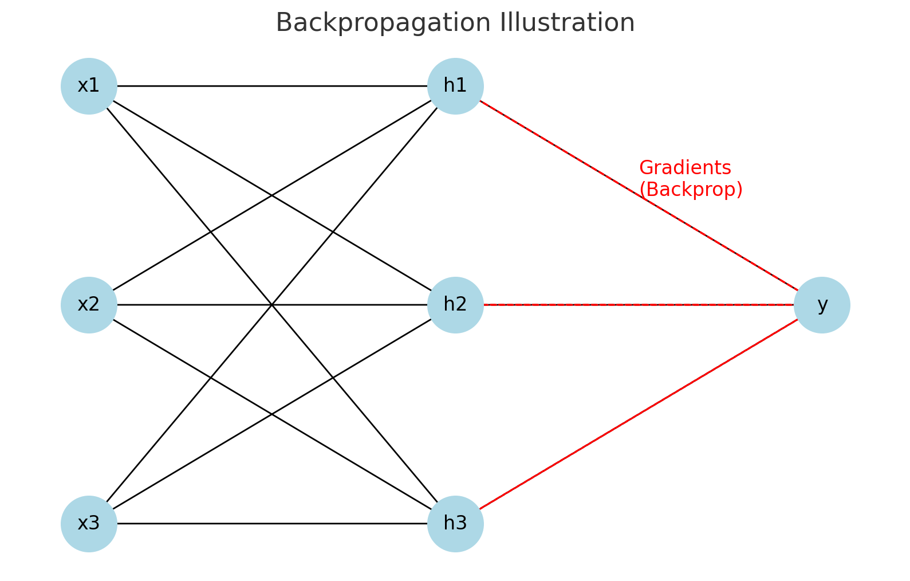

---
# You can also start simply with 'default'
theme: seriph
# random image from a curated Unsplash collection by Anthony
# like them? see https://unsplash.com/collections/94734566/slidev
background: https://cover.sli.dev
# some information about your slides (markdown enabled)
title: "Course 2: Derivative and MLP"
info: |
  ## Course 2: Derivative and MLP

  Lecture in Jike Club.
# apply unocss classes to the current slide
class: text-center
# https://sli.dev/features/drawing
drawings:
  persist: false
# slide transition: https://sli.dev/guide/animations.html#slide-transitions
transition: slide-left
# enable MDC Syntax: https://sli.dev/features/mdc
mdc: true
# take snapshot for each slide in the overview
overviewSnapshots: true
addons:
  - slidev-addon-python-runner

# Optional configuration for this runner
python:
  # Install packages from PyPI. Default: []
  installs: ["cowsay"]

  # Code executed to set up the environment. Default: ""
  prelude: |
    GREETING_FROM_PRELUDE = "Hello, Slidev!"

  # Automatically load the imported builtin packages. Default: true
  loadPackagesFromImports: true

  # Disable annoying warning from `pandas`. Default: true
  suppressDeprecationWarnings: true

  # Always reload the Python environment when the code changes. Default: false
  alwaysReload: false

  # Options passed to `loadPyodide`. Default: {}
  loadPyodideOptions: {}
---

# Course 02: 导数与多层感知机

Derivative and MLP

$$
f^\prime(x) = \lim_{h \to 0} \frac{f(x+h) - f(x)}{h}
$$

---
layout: section
---

# Section 1: 神经网络与多层感知机

---
layout: two-cols
---

# 神经元

<v-clicks>

我们已经学习过线性回归模型，而多个线性回归模型的组合可以看作是一个神经网络．

每个神经元都可以看作是一个线性回归模型，输入为 $x$，输出为 $y$．

$$
\boldsymbol{t}=f\left(\boldsymbol{W}^\textsf{T}\boldsymbol{A}+\boldsymbol{b}\right)
$$

其中，$\boldsymbol{t}$ 为输出，$\boldsymbol{W}$ 为权重，$\boldsymbol{A}$ 为输入，$\boldsymbol{b}$ 为偏置．

</v-clicks>

::right::

<v-clicks>

</v-clicks>

---
layout: two-cols
---

# 神经网络

<v-clicks>

将不同的神经元组合在一起，就可以形成一个神经网络．

神经网络可以分为多个层，每一层的神经元都可以看作是一个线性回归模型，而每一层的输出都可以看作是下一层的输入．

神经网络的输入层为输入数据，输出层为预测结果，中间的层为隐藏层．

</v-clicks>

::right::

<v-clicks>

</v-clicks>

---

# 神经网络的优化

<v-clicks>

神经网络的优化可以看作是一个最优化问题，目标是最小化损失函数．

损失函数可以看作是一个多元函数，输入为神经网络的参数，输出为损失值．

神经网络的优化可以使用梯度下降法，梯度下降法的目标是找到一个最小值，使得损失函数最小．

</v-clicks>

---

# 多层感知机

<v-clicks>

多层感知机（MLP）是最基础的神经网络模型，由输入层、隐藏层和输出层组成．

其包含多个层：

1. 输入层：输入数据的特征向量．
2. 隐藏层：多个神经元组成的层，每个神经元都可以看作是一个线性回归模型．
3. 输出层：输出预测结果的层．

每个神经元由以下部分组成：

- 输入：输入数据的特征向量．
- 权重：每个输入数据的权重，表示该输入数据对输出结果的影响程度．
- 偏置：每个神经元的偏置，表示该神经元的输出结果．
- 激活函数：每个神经元的激活函数，表示该神经元的输出结果．
- 输出：每个神经元的输出结果，表示该神经元的输出结果．

</v-clicks>

---

# 激活函数

<v-clicks>

激活函数用于将神经元的输出结果转换为非线性函数．线性函数的组合仍然是线性函数，而我们需要非线性函数来拟合复杂的函数关系．

常见的激活函数有 $\sigma$、$\tanh$ 和 $\mathrm{ReLU}$ 等．

$$
\sigma(x) = \frac{1}{1 + e^{-x}} \quad \text{Sigmoid}
$$

$$
\tanh(x) = \frac{e^x - e^{-x}}{e^x + e^{-x}} \quad \text{Tanh}
$$

$$
\mathrm{ReLU}(x) = \max(0, x) \quad \text{ReLU}
$$

</v-clicks>

---

# Dropout

<v-clicks>

Dropout 是一种正则化方法，用于防止神经网络的过拟合．

Dropout 的原理是随机丢弃一部分神经元，使得神经网络在训练时不会依赖于某些特定的神经元，从而提高模型的泛化能力．

</v-clicks>

---

# 反向传播

<v-clicks>

反向传播是神经网络的训练算法，用于计算神经网络的梯度．

反向传播的原理是链式法则，将损失函数对每个参数的偏导数计算出来，从而更新神经网络的参数．

我们将在后面详细讲解反向传播的原理和实现．

</v-clicks>

---
layout: section
---

# Section 2: 导数与梯度下降

---

# 导数、偏导与梯度

<v-clicks>

导数是函数在某一点处的切线斜率．

$$
f^\prime(x) = \lim_{h \to 0} \dfrac{f(x+h) - f(x)}{h}
$$

对于多元函数，偏导数对于某个变量的导数．如：

$$
\dfrac{\partial f}{\partial x_i} = \lim_{h \to 0} \dfrac{f(x_1, x_2, \ldots, x_i+h, \ldots, x_n) - f(x_1, x_2, \ldots, x_i, \ldots, x_n)}{h}
$$

而梯度是函数在某一点处的切线斜率的向量表示．

$$
\nabla f(x) = \begin{pmatrix}
\dfrac{\partial f}{\partial x_1} \\
\dfrac{\partial f}{\partial x_2} \\
\vdots \\
\dfrac{\partial f}{\partial x_n}
\end{pmatrix}
$$

</v-clicks>


---
layout: two-cols
---

# 梯度下降

<v-clicks>

对于函数 $f(x)$，我们希望找到一个最小值 $x^*$，使得 $f(x^*)$ 最小．

此时，随机选取一点 $x=x_0$，计算 $f(x_0)$ 的导数 $f^\prime(x_0)$，如果 $f^\prime(x_0) > 0$，则说明 $x_0$ 在最小值的右侧，此时我们需要向左移动一点；如果 $f^\prime(x_0) < 0$，则说明 $x_0$ 在最小值的左侧，此时我们需要向右移动一点．

</v-clicks>

::right::

<v-clicks>



</v-clicks>

---
layout: section
---

# 反向传播

---
layout: two-cols
---

# 反向传播的原理

<v-clicks>

反向传播（Backpropagation）是神经网络训练中的核心算法，用于计算损失函数对每个参数的梯度，从而更新参数以最小化损失函数。

反向传播的核心思想是利用链式法则，将损失函数的梯度从输出层逐层传播到输入层。

主要步骤包括：

1. **前向传播**：计算神经网络的输出和损失函数值。
2. **反向传播**：从输出层开始，逐层计算梯度。
3. **参数更新**：利用梯度下降法更新参数。

</v-clicks>

::right::

<v-clicks>



</v-clicks>

---

# 反向传播的数学公式

<v-clicks>

假设神经网络的损失函数为 $L$，输出为 $\hat{y}$，目标值为 $y$，权重为 $\boldsymbol{W}$，偏置为 $\boldsymbol{b}$，激活函数为 $f$。

1. **输出层的梯度**：
   $$
   \dfrac{\partial L}{\partial \hat{y}} = \hat{y} - y
   $$

2. **隐藏层的梯度**（链式法则）：
   $$
   \dfrac{\partial L}{\partial \boldsymbol{W}} = \dfrac{\partial L}{\partial \hat{y}} \cdot \dfrac{\partial \hat{y}}{\partial \boldsymbol{W}}
   $$

3. **参数更新**（梯度下降）：
   $$
   \boldsymbol{W} \gets \boldsymbol{W} - \eta \cdot \dfrac{\partial L}{\partial \boldsymbol{W}}
   $$

其中，$\eta$ 为学习率。

</v-clicks>

---

# 反向传播的实现

<v-clicks>

反向传播的实现通常分为以下几步：

1. **初始化参数**：随机初始化权重和偏置。
2. **前向传播**：计算每一层的输出。
3. **计算损失**：根据预测值和目标值计算损失函数。
4. **反向传播**：逐层计算梯度。
5. **更新参数**：利用梯度下降法更新权重和偏置。

反向传播的效率和准确性对神经网络的训练效果至关重要。

</v-clicks>

---
layout: section
---

# 示例代码

---

# Pre-process (you can ignore this cell)

```python
import torch
import torch.nn as nn
import torch.optim as optim
from torchvision import datasets, transforms

# Data preprocessing
transform = transforms.Compose([
    transforms.ToTensor(),
    transforms.Normalize((0.5,), (0.5,))
])

train_dataset = datasets.MNIST(root='./data', train=True, transform=transform, download=True)
test_dataset = datasets.MNIST(root='./data', train=False, transform=transform, download=True)

train_loader = torch.utils.data.DataLoader(dataset=train_dataset, batch_size=64, shuffle=True)
test_loader = torch.utils.data.DataLoader(dataset=test_dataset, batch_size=64, shuffle=False)
```

---

# Module Definition

```python
class MLP(nn.Module):
    def __init__(self):
        super(MLP, self).__init__()
        self.fc1 = nn.Linear(28 * 28, 128)
        self.relu = nn.ReLU()
        self.fc2 = nn.Linear(128, 64)
        self.fc3 = nn.Linear(64, 10)

    def forward(self, x):
        x = x.view(-1, 28 * 28)  # Flatten the input
        x = self.relu(self.fc1(x))
        x = self.relu(self.fc2(x))
        x = self.fc3(x)
        return x

# Initialize model, loss function and optimizer
model = MLP()
criterion = nn.CrossEntropyLoss()
optimizer = optim.Adam(model.parameters(), lr=0.001)

```
---

# Training and Testing

```python

# Training the model
for epoch in range(10):  # epochs
    model.train()
    for images, labels in train_loader:
        outputs = model(images)
        loss = criterion(outputs, labels)

        optimizer.zero_grad()
        loss.backward()
        optimizer.step()

    print(f"Epoch [{epoch+1}/10], Loss: {loss.item():.4f}")

# Evaluating the model
model.eval()
correct = 0
total = 0
with torch.no_grad():
    for images, labels in test_loader:
        outputs = model(images)
        _, predicted = torch.max(outputs.data, 1)
        total += labels.size(0)
        correct += (predicted == labels).sum().item()

print(f"Test Accuracy: {100 * correct / total:.2f}%")
```

---
layout: section
---

# Do It Yourself

---
layout: end
---

# Thank you!
