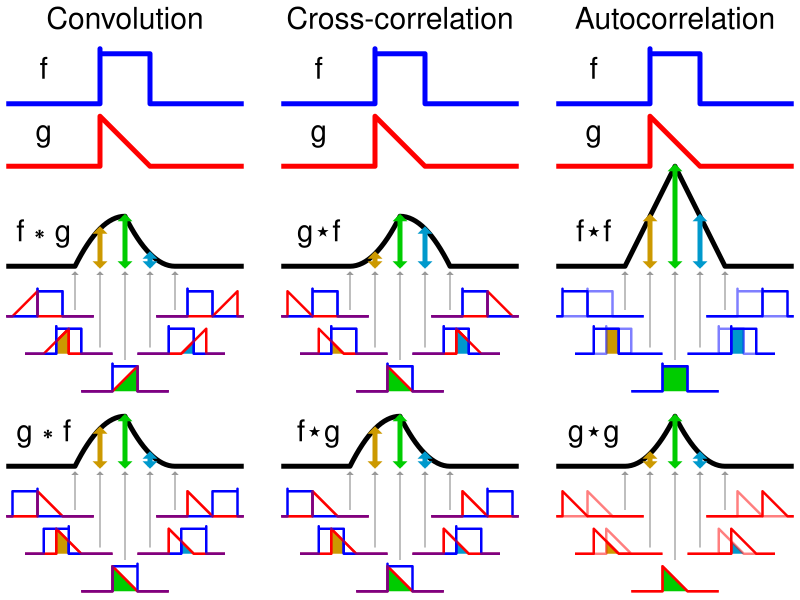
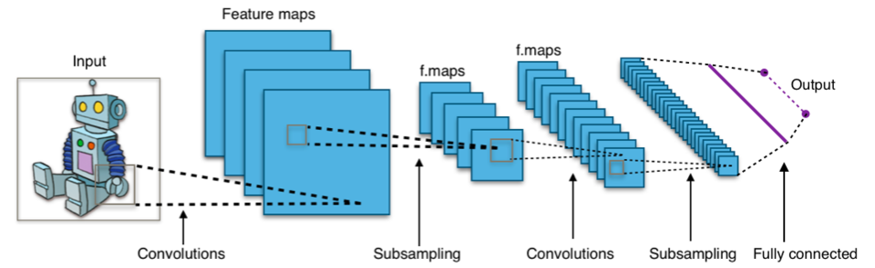

---
# You can also start simply with 'default'
theme: seriph
# random image from a curated Unsplash collection by Anthony
# like them? see https://unsplash.com/collections/94734566/slidev
background: https://cover.sli.dev
# some information about your slides (markdown enabled)
title: "Course 3: Convolutional Neural Network and Computer Vision"
info: |
  ## Course 2: Convolutional Neural Network and Computer Vision

  Lecture in Jike Club.
# apply unocss classes to the current slide
class: text-center
# https://sli.dev/features/drawing
drawings:
  persist: false
# slide transition: https://sli.dev/guide/animations.html#slide-transitions
transition: slide-left
# enable MDC Syntax: https://sli.dev/features/mdc
mdc: true
# take snapshot for each slide in the overview
overviewSnapshots: true
addons:
  - slidev-addon-python-runner

# Optional configuration for this runner
python:
  # Install packages from PyPI. Default: []
  installs: ["cowsay"]

  # Code executed to set up the environment. Default: ""
  prelude: |
    GREETING_FROM_PRELUDE = "Hello, Slidev!"

  # Automatically load the imported builtin packages. Default: true
  loadPackagesFromImports: true

  # Disable annoying warning from `pandas`. Default: true
  suppressDeprecationWarnings: true

  # Always reload the Python environment when the code changes. Default: false
  alwaysReload: false

  # Options passed to `loadPyodide`. Default: {}
  loadPyodideOptions: {}
---

# Course 03: 卷积神经网络与计算机视觉

Convolutional Neural Network and Computer Vision

<div style="text-align: left">

```python
model = nn.Sequential(
    nn.Conv2d(1, 32, kernel_size=3, stride=1, padding=1),
    nn.ReLU(),
    nn.MaxPool2d(kernel_size=2, stride=2),
    nn.Conv2d(32, 64, kernel_size=3, stride=1, padding=1),
    nn.ReLU(),
    nn.MaxPool2d(kernel_size=2, stride=2),
    nn.Flatten(),
    nn.Linear(64 * 7 * 7, 128),
    nn.ReLU(),
    nn.Linear(128, 10)
)
```

</div>

---
layout: section
---

# Section 1: 卷积与池化

---
layout: two-cols
---

# 卷积操作

<v-clicks>

卷积操作是卷积神经网络中的核心操作之一，其通过类似「滑动窗口」的方式对输入数据进行处理。

假设矩阵 $\boldsymbol{A}$ 为输入数据，

$$
\boldsymbol{A} = \begin{bmatrix}
1 & 2 & 3 & 4 \\
5 & 6 & 7 & 8 \\
9 & 10 & 11 & 12 \\
13 & 14 & 15 & 16
\end{bmatrix}
$$

卷积核 $\boldsymbol{K} = \begin{bmatrix} 1 & 0 \\ 0 & -1 \end{bmatrix}$，间距 `stride` 为 1，填充 `padding` 为 0。

</v-clicks>

::right::

<v-clicks>



</v-clicks>

---

# 卷积操作详解

<v-clicks>

卷积核 $\boldsymbol{K} = \begin{bmatrix} 1 & 0 \\ 0 & -1 \end{bmatrix}$ 在输入矩阵 $\boldsymbol{A} = \begin{bmatrix} 1 & 2 & 3 & 4 \\ 5 & 6 & 7 & 8 \\ 9 & 10 & 11 & 12 \\ 13 & 14 & 15 & 16 \end{bmatrix}$ 上滑动，计算卷积操作。

首先，在 $\boldsymbol{A}$ 的左上角开始，计算卷积操作：

$$
\boldsymbol{A}_1 * \boldsymbol{K} = \begin{bmatrix}
1 & 2 \\
5 & 6
\end{bmatrix} * \begin{bmatrix}
1 & 0 \\
0 & -1
\end{bmatrix} = 1 \cdot 1 + 2 \cdot 0 + 5 \cdot 0 + 6 \cdot (-1) = -5
$$

随后，卷积核向右滑动一个单位，计算下一个位置的卷积操作：

$$
\boldsymbol{A}_2 * \boldsymbol{K} = \begin{bmatrix}
2 & 3 \\
6 & 7
\end{bmatrix} * \begin{bmatrix}
1 & 0 \\
0 & -1
\end{bmatrix} = 2 \cdot 1 + 3 \cdot 0 + 6 \cdot 0 + 7 \cdot (-1) = -5
$$

以此类推，卷积核在整个输入矩阵上滑动，最终得到输出矩阵：

$$
\boldsymbol{O} = \begin{bmatrix}
-5 & -5 \\
-5 & -5
\end{bmatrix}
$$

</v-clicks>

---
layout: two-cols
---

# 池化

<v-clicks>

池化是卷积神经网络中的另一个重要操作，其主要作用是降低特征图的尺寸，从而减少计算量和防止过拟合。

在本节中我们介绍池化（pooling）层，它的提出是为了缓解卷积层对位置的过度敏感性。

对于矩阵 $\boldsymbol{A}=\begin{bmatrix} 1 & 2 & 3 & 4 \\ 5 & 6 & 7 & 8 \\ 9 & 10 & 11 & 12 \\ 13 & 14 & 15 & 16 \end{bmatrix}$，我们使用最大池化（max pooling）操作。

以 $2\times2$ 的池化窗口为例，以左上角为例：

$$
\mathrm{Pooling}(\boldsymbol{A}_{[0:2,0:2]}) = \max\left(\begin{bmatrix} 1 & 2 \\ 5 & 6 \end{bmatrix}\right) = 6
$$

</v-clicks>

::right::

<v-clicks>

</v-clicks>

---

# 池化操作分类

<v-clicks>

池化有多种类型，最常用的有最大池化（max pooling）和平均池化（average pooling）。

- 最大池化：取池化窗口内的最大值。
- 平均池化：取池化窗口内的平均值。

同时，还有 $L_2$ 池化、随机池化等。在此不做赘述。

</v-clicks>

---
layout: section
---

# 卷积神经网络

---

# 卷积神经网络简介

<v-clicks>

卷积神经网络（英语：convolutional neural network，缩写：CNN）是一种前馈神经网络，它的人工神经元可以响应一部分覆盖范围内的周围单元，对于大型图像处理有出色表现。

卷积神经网络由一个或多个卷积层和顶端的全连通层（对应经典的神经网络）组成，同时也包括关联权重和池化层（pooling layer）。这一结构使得卷积神经网络能够利用输入数据的二维结构。与其他深度学习结构相比，卷积神经网络在图像和语音识别方面能够给出更好的结果。这一模型也可以使用反向传播算法进行训练。相比较其他深度、前馈神经网络，卷积神经网络需要考量的参数更少，使之成为一种颇具吸引力的深度学习结构[2]。

卷积神经网络的灵感来自于动物视觉皮层组织的神经连接方式。单个神经元只对有限区域内的刺激作出反应，不同神经元的感知区域相互重叠从而覆盖整个视野。

</v-clicks>

---

# 卷积神经网络的结构

<v-clicks>

卷积神经网络的结构通常包括以下几个部分：



- 输入层：输入数据的原始数据。
- 卷积层：通过卷积操作提取特征。
- 激活层：通常使用 ReLU 激活函数。
- 池化层：降低特征图的尺寸。
- 全连接层：将特征图展平并进行分类。
- 输出层：输出分类结果。

</v-clicks>

---
layout: section
---

# MNIST 实现

---
layout: two-cols
---

# MNIST 数据集介绍

<v-clicks>

上节课我们讲了用普通的 MLP 来训练 MNIST 数据集，今天我们来讲讲卷积神经网络。

该数据库通过对来自 NIST 原始数据库的样本进行修改创建，涵盖手写数字的图像，共包含 $60,000$ 张训练图像和 $10,000$ 张测试图像，尺寸为 $28 \times 28$ 像素。

该数据库广泛运用于机器学习领域的训练与测试当中。MNIST 在其发布时使用支持向量机的错误率为 $0.8\%$，但一些研究后来通过使用深度学习技术显著改进了这一成绩。

</v-clicks>

::right::

<v-clicks>


</v-clicks>

---

# LeNet

<v-clicks>

LeNet 是由 Yann LeCun 等人于 1989 年提出的卷积神经网络模型，最初用于手写数字识别。

LeNet 由多个卷积层、池化层和全连接层组成，具有较少的参数量和较好的性能。

LeNet 的结构如下：

- 输入层：输入图像为 $28 \times 28$ 像素的灰度图像。
- 卷积层 1：使用 $5 \times 5$ 的卷积核，输出 $6$ 个特征图，步幅为 $1$，填充为 $2$。
- 池化层 1：使用 $2 \times 2$ 的池化窗口，步幅为 $2$，进行最大池化。
- 卷积层 2：使用 $5 \times 5$ 的卷积核，输出 $16$ 个特征图，步幅为 $1$，填充为 $0$。
- 池化层 2：使用 $2 \times 2$ 的池化窗口，步幅为 $2$，进行最大池化。
- 全连接层 1：将特征图展平，输出 $120$ 个神经元。
- 全连接层 2：输出 $84$ 个神经元。
- 输出层：输出 $10$ 个神经元，对应 $10$ 个数字类别。

</v-clicks>

---

# LeNet 代码实现

以 LeNet 5 为例。

<v-clicks>

```python
class LeNet5(nn.Module):
    def __init__(self):
        super(LeNet5, self).__init__()
        self.features = nn.Sequential(
            nn.Conv2d(1, 6, kernel_size=5),   # (1,32,32) → (6,28,28)
            nn.Tanh(),
            nn.AvgPool2d(2, stride=2),        # (6,28,28) → (6,14,14)
            nn.Conv2d(6, 16, kernel_size=5),  # (6,14,14) → (16,10,10)
            nn.Tanh(),
            nn.AvgPool2d(2, stride=2),        # (16,10,10) → (16,5,5)
            nn.Conv2d(16, 120, kernel_size=5),# (16,5,5) → (120,1,1)
            nn.Tanh()
        )
        self.classifier = nn.Sequential(
            nn.Linear(120, 84),
            nn.Tanh(),
            nn.Linear(84, 10)
        )

    def forward(self, x):
        x = self.features(x)
        x = x.view(x.size(0), -1)  # flatten
        x = self.classifier(x)
        return x
```

</v-clicks>
